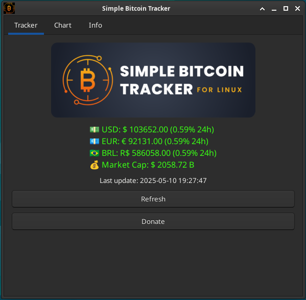
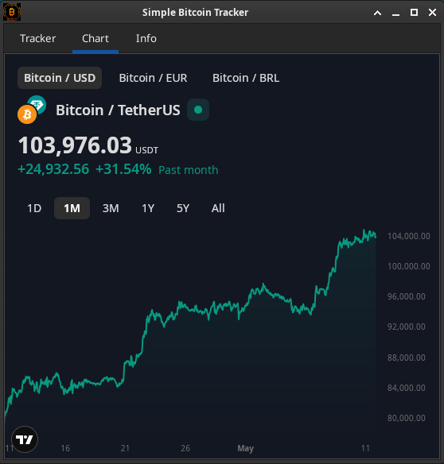

# 🪙 Simple Bitcoin Tracker

**Simple Bitcoin Tracker** is a lightweight desktop application for Debian-based systems that displays real-time Bitcoin price data in USD, EUR, and BRL, along with market cap and daily changes.

Built with Python and GTK, it’s designed to be simple, clean, and efficient.

---

## 📦 Features

- Live Bitcoin price in USD, EUR, and BRL
- Market capitalization
- Price variation (24h)

---

## 🖥️ Screenshots

 

---

## ⚙️ Requirements

Before installing, make sure the following dependencies are installed:

```bash
sudo apt update
sudo apt install -y python3 python3-gi python3-requests gir1.2-gtk-4.0
```

---

## 📥 Installation

**Option 1**: Install via .deb package
Download the .deb file from the [Releases](https://github.com/jancordeiro/simple-bitcoin-tracker/releases) section.

Run the installer:

```bash
sudo apt install ./simple-bitcoin-tracker_1.0.deb
```
**Option 2**: Manual build
If you'd like to build from source:

```bash
# Clone the repository
git clone https://github.com/jancordeiro/simple-bitcoin-tracker.git
cd simple-bitcoin-tracker

# Make the build script executable
chmod +x build-deb.sh

# Build the package
./build-deb.sh

# Install the resulting .deb
sudo apt install ./simple-bitcoin-tracker_1.0.deb
```

---

## 🚀 Usage
After installation, find Simple Bitcoin Tracker in your app menu or launch it via terminal:

```bash
simple-bitcoin-tracker
```

---

## 📝 License
This project is open-source under the MIT License.
